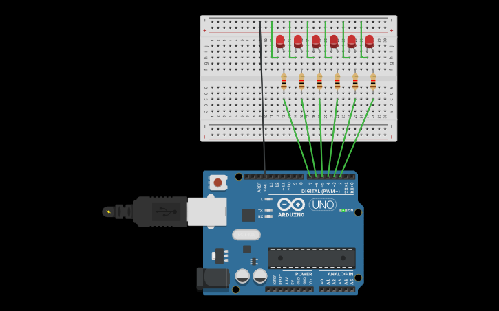

# Проект "LedCascade": Управление светодиодами через регистры и прерывания

**Авторы:** [Акимов Игорь](https://github.com/Zelmoron), [Носаченко Альберт](https://github.com/mumok4)

## 1. Введение

### 1.1. Проблема
При создании проектов, требующих одновременного выполнения нескольких действий, стандартная функция `delay()` становится серьезным препятствием. Она полностью останавливает выполнение программы, не позволяя микроконтроллеру реагировать на внешние события, такие как нажатие кнопок или получение данных с датчиков.

### 1.2. Предлагаемое решение
Данный проект демонстрирует эффективный способ управления шестью светодиодами с использованием прямого доступа к регистрам портов и аппаратных прерываний таймера. Такой подход не блокирует основной цикл программы, позволяет добиться максимальной производительности и является стандартом в более серьезной разработке под микроконтроллеры AVR.

### 1.3. Цели и задачи
- **Цель:** Создать высокопроизводительную систему для независимого асинхронного управления шестью светодиодами.
- **Задачи:**
    - Собрать электрическую схему.
    - Написать прошивку на C/C++, используя прямую манипуляцию регистрами (`DDRD`, `PORTD`) для настройки пинов.
    - Настроить аппаратный Таймер/Счетчик №2 для генерации периодических прерываний.
    - Реализовать логику мигания внутри обработчика прерываний (ISR).
    - Подготовить работающую симуляцию проекта в Tinkercad.

## 2. Аппаратная часть

### 2.1. Компоненты

| Компонент | Кол-во | Назначение |
|---|---|---|
| Плата Arduino Uno | 1 | Управляющий микроконтроллер. |
| Светодиод (красный, 5мм) | 6 | Индикаторы. |
| Резистор 220 Ом | 6 | Ограничение тока, проходящего через светодиоды. |
| Макетная плата (Breadboard) | 1 | Для сборки схемы без пайки. |
| Соединительные провода | - | Для коммутации компонентов. |

### 2.2. Электрическая схема
Шесть светодиодов подключаются к цифровым пинам Arduino со 2-го по 7-й через токоограничивающие резисторы. Все катоды (короткие выводы) светодиодов через резисторы соединены с общей землей (GND).

*Примечание: Изображение ниже демонстрирует подключение пяти светодиодов. Для полного соответствия коду необходимо добавить шестой светодиод, подключенный к цифровому пину 2 по аналогии с остальными.*



*Рис. 1 - Принципиальная электрическая схема устройства.*

**Описание схемы:**
- Цифровые пины `2, 3, 4, 5, 6, 7` платы Arduino подключены к анодам (длинным выводам) соответствующих светодиодов.
- Катоды светодиодов подключены к резисторам на 220 Ом.
- Вторые выводы резисторов подключены к общей шине "земли" на макетной плате.
- Пин `GND` на Arduino соединен с шиной "земли" на макетной плате.

## 3. Программная часть

### 3.1. Логика работы прошивки
Вся работа выполняется на низком уровне, без использования высокоуровневых функций Arduino, что обеспечивает максимальное быстродействие.

1.  **Инициализация (`setup`):**
    - Через регистр `DDRD` (Data Direction Register for Port D) пины 2-7 настраиваются как выходы.
    - Через регистр `PORTD` (Port D Data Register) на все эти пины подается высокий уровень, зажигая светодиоды при старте.
    - Настраивается Таймер/Счетчик №2 для генерации прерывания с частотой примерно 100 Гц (каждые 10 мс).
2.  **Обработчик прерываний (`ISR(TIMER2_COMPA_vect)`):**
    - Эта функция автоматически вызывается аппаратно каждые 10 мс.
    - Для каждого светодиода инкрементируется свой счетчик.
    - Когда счетчик достигает заданного порога, состояние светодиода инвертируется путем установки или сброса соответствующего бита в регистре `PORTD`. Счетчик сбрасывается.
3.  **Основной цикл (`loop`):**
    - Остается абсолютно пустым, так как вся работа по управлению светодиодами происходит в фоновом режиме на уровне аппаратных прерываний.

### 3.2. Исходный код

```cpp
const uint8_t ledPins[6] = {2, 3, 4, 5, 6, 7};
const uint8_t LED_PERIODS[6] = {2, 4, 6, 8, 10, 12};
volatile uint8_t counters[6] = {0, 0, 0, 0, 0, 0};
volatile uint8_t ledStates[6] = {1, 1, 1, 1, 1, 1};

void setup() {
  DDRD |= (1 << PD2);
  DDRD |= (1 << PD3);
  DDRD |= (1 << PD4);
  DDRD |= (1 << PD5);
  DDRD |= (1 << PD6);
  DDRD |= (1 << PD7);
  
  PORTD |= (1 << PD2);
  PORTD |= (1 << PD3);
  PORTD |= (1 << PD4);
  PORTD |= (1 << PD5);
  PORTD |= (1 << PD6);
  PORTD |= (1 << PD7);
  
  cli();
  
  TCCR2A = 0;
  TCCR2B = 0;
  TCNT2 = 0;
  
  TCCR2A |= (1 << WGM21);
  TCCR2B |= (1 << CS22) | (1 << CS21) | (1 << CS20);
  OCR2A = 155;
  TIMSK2 |= (1 << OCIE2A);
  
  sei();
}

ISR(TIMER2_COMPA_vect) {
  for (uint8_t i = 0; i < 6; i++) {
    counters[i]++;
    
    if (counters[i] >= LED_PERIODS[i]) {
      counters[i] = 0;
      ledStates[i] ^= 1;
      
      if (ledStates[i]) {
        PORTD |= (1 << (PD2 + i));
      } else {
        PORTD &= ~(1 << (PD2 + i));
      }
    }
  }
}

void loop() {
}
```

## 4. Симуляция в Tinkercad

Для проверки корректности кода была создана симуляция в среде Tinkercad, которая полностью эмулирует работу микроконтроллера ATmega328P на низком уровне.

**Ссылка на симуляцию:** [https://www.tinkercad.com/things/1ePme2YCXrJ-epic-krunk-sango?sharecode=Qah8m7rcpLQVdYNDYvW2LIDJaNpkBUxhNcP7Xwzssb4](https://www.tinkercad.com/things/1ePme2YCXrJ-epic-krunk-sango?sharecode=Qah8m7rcpLQVdYNDYvW2LIDJaNpkBUxhNcP7Xwzssb4)

**Описание работы симуляции:**
При запуске моделирования код компилируется и выполняется на виртуальном контроллере. Шесть светодиодов на пинах 2-7 начинают мигать с разной, четко заданной в коде частотой, подтверждая правильность настройки таймера и логики обработчика прерываний.

## 5. Демонстрация на реальном устройстве

### 5.1. Сборка устройства
Прототип был собран на макетной плате согласно электрической схеме. Прямая работа с портами никак не влияет на физическую сборку схемы.

### 5.2. Видео-демонстрация
Полный цикл работы устройства, собранного на реальной плате Arduino Uno, показан в видео.


https://github.com/user-attachments/assets/ff9e8e45-fa4f-4de6-ab55-8fba4936e207


В видео можно наблюдать, как сразу после подачи питания светодиоды начинают асинхронно мигать, что доказывает корректную работу прошивки на реальном оборудовании.

## 6. Результаты и выводы

### 6.1. Полученные результаты
Проект успешно выполнен. Продемонстрирован профессиональный подход к управлению периферией микроконтроллера без использования блокирующих функций и высокоуровневых абстракций Arduino. Система работает предсказуемо, эффективно и оставляет ресурсы процессора свободными для других задач.

### 6.2. Возможные улучшения
- **Оптимизация ISR:** Для еще большей производительности можно заменить цикл `for` в обработчике прерываний на прямую последовательную обработку каждого счетчика.
- **Динамическое управление:** Добавить в `loop()` обработку команд из последовательного порта (Serial), которые могли бы изменять значения в массиве `LED_PERIODS`, позволяя на лету менять скорость мигания.
